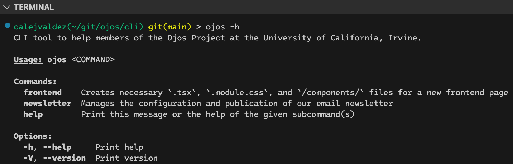

# Ojos CLI


## Table of Contents

- [Ojos CLI](#ojos-cli)
  - [Table of Contents](#table-of-contents)
  - [Description](#description)
    - [Features](#features)
  - [Visuals](#visuals)
  - [Installation](#installation)
  - [Usage](#usage)
  - [Support](#support)
  - [License](#license)

## Description

A CLI tool for Ojos Project development.

### Features

- Create a new page for frontend development

## Visuals



## Installation

To install this, you must clone the repository and run the following command:

```shell
cargo install --path .
```

## Usage

Create a new page for frontend development.

```shell
ojos frontend
```

Create a page, but skip the naming portion.

```shell
ojos frontend --filename page_name
```

Create a page, skipping user input. (Assume yes)

```shell
ojos frontend --filename page_name -y
```

## Support

If you need help with the program, please run any of the following commands:

- `ojos`
- `ojos frontend --help`

## License

[GNU GPLv3](https://choosealicense.com/licenses/gpl-3.0/)
